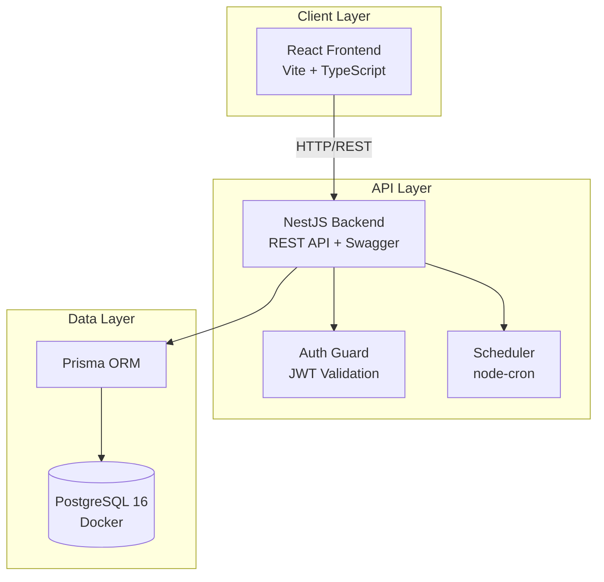
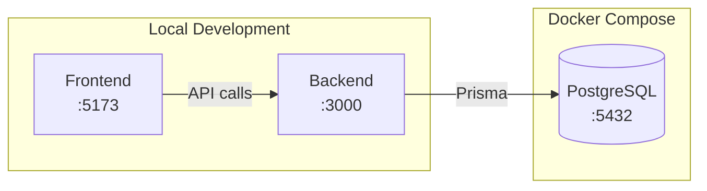
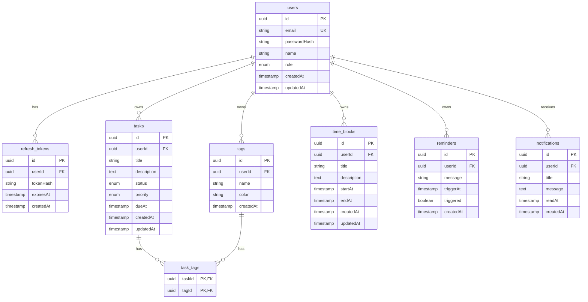
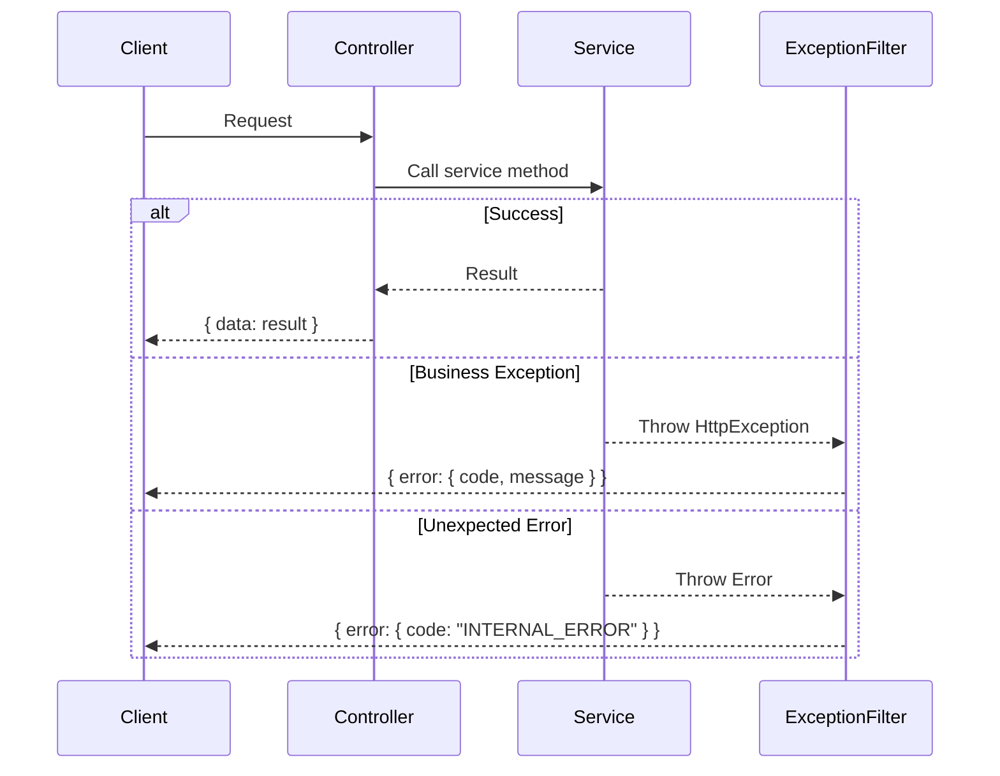

# Design Document: Time Manager

## Overview

Time Manager là một ứng dụng web full-stack cho phép người dùng quản lý công việc, lên lịch thời gian, và theo dõi năng suất. Hệ thống được xây dựng với kiến trúc client-server, sử dụng:

- **Backend**: Node.js + TypeScript với NestJS framework
- **Frontend**: React + TypeScript với Vite
- **Database**: PostgreSQL 16 (Docker)
- **ORM**: Prisma với migrations
- **Authentication**: JWT (access + refresh tokens)

## Architecture

### System Architecture Diagram



### Deployment Architecture



## Components and Interfaces

### Backend Modules

```
backend/
├── src/
│   ├── app.module.ts              # Root module
│   ├── main.ts                    # Entry point + Swagger setup
│   ├── common/
│   │   ├── decorators/            # Custom decorators (@CurrentUser)
│   │   ├── filters/               # Exception filters
│   │   ├── guards/                # JwtAuthGuard
│   │   ├── interceptors/          # Logging, Transform
│   │   └── dto/                   # Common DTOs (pagination, response)
│   ├── auth/
│   │   ├── auth.module.ts
│   │   ├── auth.controller.ts     # /auth endpoints
│   │   ├── auth.service.ts        # Business logic
│   │   ├── strategies/            # JWT strategy
│   │   └── dto/                   # Login, Register DTOs
│   ├── users/
│   │   ├── users.module.ts
│   │   ├── users.service.ts
│   │   └── dto/
│   ├── tasks/
│   │   ├── tasks.module.ts
│   │   ├── tasks.controller.ts    # /tasks endpoints
│   │   ├── tasks.service.ts
│   │   └── dto/
│   ├── tags/
│   │   ├── tags.module.ts
│   │   ├── tags.controller.ts     # /tags endpoints
│   │   ├── tags.service.ts
│   │   └── dto/
│   ├── time-blocks/
│   │   ├── time-blocks.module.ts
│   │   ├── time-blocks.controller.ts
│   │   ├── time-blocks.service.ts # Overlap validation
│   │   └── dto/
│   ├── reminders/
│   │   ├── reminders.module.ts
│   │   ├── reminders.controller.ts
│   │   ├── reminders.service.ts
│   │   └── dto/
│   ├── notifications/
│   │   ├── notifications.module.ts
│   │   ├── notifications.controller.ts
│   │   ├── notifications.service.ts
│   │   └── dto/
│   ├── dashboard/
│   │   ├── dashboard.module.ts
│   │   ├── dashboard.controller.ts
│   │   └── dashboard.service.ts   # Analytics queries
│   ├── scheduler/
│   │   ├── scheduler.module.ts
│   │   └── scheduler.service.ts   # node-cron jobs
│   └── prisma/
│       ├── prisma.module.ts
│       └── prisma.service.ts
├── prisma/
│   ├── schema.prisma
│   ├── migrations/
│   └── seed.ts
└── test/
    ├── unit/
    └── integration/
```

### Frontend Structure

```
frontend/
├── src/
│   ├── main.tsx                   # Entry point
│   ├── App.tsx                    # Root component + Router
│   ├── app/
│   │   ├── router.tsx             # Route definitions
│   │   └── queryClient.ts         # TanStack Query config
│   ├── services/
│   │   ├── api.ts                 # Axios instance
│   │   ├── auth.service.ts
│   │   ├── tasks.service.ts
│   │   ├── tags.service.ts
│   │   ├── time-blocks.service.ts
│   │   ├── reminders.service.ts
│   │   ├── notifications.service.ts
│   │   └── dashboard.service.ts
│   ├── pages/
│   │   ├── Login.tsx
│   │   ├── Register.tsx
│   │   ├── Dashboard.tsx
│   │   ├── Tasks.tsx
│   │   ├── Calendar.tsx
│   │   ├── Reminders.tsx
│   │   └── Notifications.tsx
│   ├── components/
│   │   ├── layout/
│   │   ├── auth/
│   │   ├── tasks/
│   │   ├── calendar/
│   │   └── common/
│   ├── store/
│   │   └── auth.store.ts          # Auth state (zustand or context)
│   ├── hooks/
│   │   ├── useAuth.ts
│   │   └── useNotifications.ts
│   └── types/
│       └── index.ts               # TypeScript interfaces
└── public/
```

### API Endpoints

| Method | Endpoint | Description | Auth |
|--------|----------|-------------|------|
| GET | /health | Health check | No |
| POST | /auth/register | User registration | No |
| POST | /auth/login | User login | No |
| POST | /auth/refresh | Refresh tokens | No |
| POST | /auth/logout | User logout | Yes |
| GET | /tasks | List user tasks | Yes |
| POST | /tasks | Create task | Yes |
| GET | /tasks/:id | Get task | Yes |
| PATCH | /tasks/:id | Update task | Yes |
| DELETE | /tasks/:id | Delete task | Yes |
| GET | /tags | List user tags | Yes |
| POST | /tags | Create tag | Yes |
| DELETE | /tags/:id | Delete tag | Yes |
| POST | /tasks/:id/tags | Assign tags to task | Yes |
| DELETE | /tasks/:id/tags/:tagId | Remove tag from task | Yes |
| GET | /time-blocks | List time blocks | Yes |
| POST | /time-blocks | Create time block | Yes |
| PATCH | /time-blocks/:id | Update time block | Yes |
| DELETE | /time-blocks/:id | Delete time block | Yes |
| GET | /reminders | List reminders | Yes |
| POST | /reminders | Create reminder | Yes |
| DELETE | /reminders/:id | Delete reminder | Yes |
| GET | /notifications | List notifications | Yes |
| GET | /notifications/unread-count | Get unread count | Yes |
| PATCH | /notifications/:id/read | Mark as read | Yes |
| GET | /dashboard/stats | Get statistics | Yes |
| GET | /dashboard/focus-time | Get focus time | Yes |

## Data Models

### Entity Relationship Diagram



### Prisma Schema

```prisma
enum Role {
  USER
  ADMIN
}

enum TaskStatus {
  TODO
  IN_PROGRESS
  DONE
}

enum TaskPriority {
  LOW
  MEDIUM
  HIGH
}

model User {
  id            String         @id @default(uuid())
  email         String         @unique
  passwordHash  String
  name          String
  role          Role           @default(USER)
  createdAt     DateTime       @default(now())
  updatedAt     DateTime       @updatedAt
  
  refreshTokens RefreshToken[]
  tasks         Task[]
  tags          Tag[]
  timeBlocks    TimeBlock[]
  reminders     Reminder[]
  notifications Notification[]
  
  @@map("users")
}

model RefreshToken {
  id        String   @id @default(uuid())
  userId    String
  tokenHash String
  expiresAt DateTime
  createdAt DateTime @default(now())
  
  user User @relation(fields: [userId], references: [id], onDelete: Cascade)
  
  @@index([userId])
  @@map("refresh_tokens")
}

model Task {
  id          String       @id @default(uuid())
  userId      String
  title       String
  description String?
  status      TaskStatus   @default(TODO)
  priority    TaskPriority @default(MEDIUM)
  dueAt       DateTime?
  createdAt   DateTime     @default(now())
  updatedAt   DateTime     @updatedAt
  
  user User      @relation(fields: [userId], references: [id], onDelete: Cascade)
  tags TaskTag[]
  
  @@index([userId])
  @@index([status])
  @@index([dueAt])
  @@map("tasks")
}

model Tag {
  id        String    @id @default(uuid())
  userId    String
  name      String
  color     String    @default("#3B82F6")
  createdAt DateTime  @default(now())
  
  user  User      @relation(fields: [userId], references: [id], onDelete: Cascade)
  tasks TaskTag[]
  
  @@unique([userId, name])
  @@index([userId])
  @@map("tags")
}

model TaskTag {
  taskId String
  tagId  String
  
  task Task @relation(fields: [taskId], references: [id], onDelete: Cascade)
  tag  Tag  @relation(fields: [tagId], references: [id], onDelete: Cascade)
  
  @@id([taskId, tagId])
  @@map("task_tags")
}

model TimeBlock {
  id          String   @id @default(uuid())
  userId      String
  title       String
  description String?
  startAt     DateTime
  endAt       DateTime
  createdAt   DateTime @default(now())
  updatedAt   DateTime @updatedAt
  
  user User @relation(fields: [userId], references: [id], onDelete: Cascade)
  
  @@index([userId])
  @@index([startAt, endAt])
  @@map("time_blocks")
}

model Reminder {
  id        String   @id @default(uuid())
  userId    String
  message   String
  triggerAt DateTime
  triggered Boolean  @default(false)
  createdAt DateTime @default(now())
  
  user User @relation(fields: [userId], references: [id], onDelete: Cascade)
  
  @@index([userId])
  @@index([triggerAt])
  @@map("reminders")
}

model Notification {
  id        String    @id @default(uuid())
  userId    String
  title     String
  message   String
  readAt    DateTime?
  createdAt DateTime  @default(now())
  
  user User @relation(fields: [userId], references: [id], onDelete: Cascade)
  
  @@index([userId])
  @@index([readAt])
  @@map("notifications")
}
```


## Correctness Properties

*A property is a characteristic or behavior that should hold true across all valid executions of a system-essentially, a formal statement about what the system should do. Properties serve as the bridge between human-readable specifications and machine-verifiable correctness guarantees.*

Based on the prework analysis, the following correctness properties have been identified. Redundant properties have been consolidated where one property implies another.

### Authentication Properties

**Property 1: Password Hashing Integrity**
*For any* valid registration data, the created user's passwordHash SHALL NOT equal the plain text password and SHALL be verifiable using the same hashing algorithm.
**Validates: Requirements 2.1**

**Property 2: Token Round-Trip Consistency**
*For any* valid user, logging in and then using the refresh token to get new tokens SHALL produce valid tokens that can authenticate subsequent requests.
**Validates: Requirements 2.2, 2.3**

**Property 3: Logout Invalidation**
*For any* valid session, after logout the refresh token SHALL be invalid and cannot be used to obtain new access tokens.
**Validates: Requirements 2.4**

**Property 4: Authentication Enforcement**
*For any* protected endpoint and any request without valid JWT, the response SHALL be HTTP 401 Unauthorized.
**Validates: Requirements 2.5**

**Property 5: Authorization Enforcement**
*For any* user A and any resource owned by user B where A ≠ B, user A's request to access that resource SHALL return HTTP 403 Forbidden.
**Validates: Requirements 2.6**

### Task Management Properties

**Property 6: Task Data Isolation**
*For any* user requesting their task list, all returned tasks SHALL have userId equal to the requesting user's ID.
**Validates: Requirements 3.2**

**Property 7: Task CRUD Consistency**
*For any* valid task data, creating a task and then fetching it by ID SHALL return the same task data with generated ID and timestamps.
**Validates: Requirements 3.1, 3.3**

**Property 8: Task Deletion Cascade**
*For any* task with associated tags, deleting the task SHALL remove all task_tags relationships while preserving the tags themselves.
**Validates: Requirements 3.4**

**Property 9: Task Filter Correctness**
*For any* filter criteria (status, priority, date range), all returned tasks SHALL match the specified criteria.
**Validates: Requirements 3.5**

**Property 10: Task Search Correctness**
*For any* search keyword, all returned tasks SHALL contain the keyword in either title or description (case-insensitive).
**Validates: Requirements 3.6**

### Tag Management Properties

**Property 11: Tag-Task Relationship Integrity**
*For any* tag assigned to a task, the task_tags table SHALL contain a record linking that task and tag, and removing the tag from the task SHALL delete only that specific relationship.
**Validates: Requirements 4.2, 4.3**

**Property 12: Tag Deletion Cascade**
*For any* tag with associated tasks, deleting the tag SHALL remove all task_tags relationships while preserving the tasks themselves.
**Validates: Requirements 4.4**

### Time Block Properties

**Property 13: Time Block Temporal Validity**
*For any* time block, the startAt timestamp SHALL be strictly less than the endAt timestamp.
**Validates: Requirements 5.1, 12.2**

**Property 14: Time Block Non-Overlap**
*For any* user with existing time blocks, creating or updating a time block that overlaps (startA < endB AND startB < endA) with an existing block SHALL be rejected with HTTP 409.
**Validates: Requirements 5.2, 5.4**

**Property 15: Time Block Range Query**
*For any* date range query, all returned time blocks SHALL have startAt or endAt within the specified range.
**Validates: Requirements 5.3**

### Notification Properties

**Property 16: Reminder Trigger Creates Notification**
*For any* reminder with triggerAt in the past and triggered=false, after scheduler runs, a notification SHALL exist for that user and the reminder SHALL have triggered=true.
**Validates: Requirements 6.2**

**Property 17: Notification Ordering**
*For any* notification list request, the returned notifications SHALL be sorted by createdAt in descending order.
**Validates: Requirements 6.3**

**Property 18: Notification Read State**
*For any* notification marked as read, the readAt field SHALL be set to a non-null timestamp, and unread count SHALL decrease by 1.
**Validates: Requirements 6.4, 6.5**

### Dashboard Properties

**Property 19: Statistics Accuracy**
*For any* user's dashboard statistics, the counts SHALL accurately reflect: tasks with dueAt = today, tasks with dueAt < today AND status ≠ DONE, and tasks with status = DONE AND updatedAt within current week.
**Validates: Requirements 7.1**

**Property 20: Focus Time Calculation**
*For any* user's focus time request, the total duration SHALL equal the sum of (endAt - startAt) for all time blocks within the current week.
**Validates: Requirements 7.2**

### API Response Properties

**Property 21: Success Response Format**
*For any* successful API response, the body SHALL contain a `data` field and optionally a `meta` field with pagination info.
**Validates: Requirements 8.1**

**Property 22: Error Response Format**
*For any* failed API response, the body SHALL contain an `error` object with `code` and `message` string fields.
**Validates: Requirements 8.2**

### Serialization Properties

**Property 23: Date Serialization Round-Trip**
*For any* entity with timestamp fields, serializing to JSON and deserializing back SHALL produce equivalent timestamp values (ISO 8601 format).
**Validates: Requirements 12.4, 12.5**

## Error Handling

### Error Response Structure

```typescript
interface ErrorResponse {
  error: {
    code: string;      // e.g., "AUTH_INVALID_CREDENTIALS"
    message: string;   // Human-readable message
    details?: object;  // Additional context (validation errors, etc.)
  };
}
```

### Error Codes

| Code | HTTP Status | Description |
|------|-------------|-------------|
| AUTH_INVALID_CREDENTIALS | 401 | Invalid email or password |
| AUTH_TOKEN_EXPIRED | 401 | JWT token has expired |
| AUTH_TOKEN_INVALID | 401 | JWT token is malformed or invalid |
| AUTH_REFRESH_INVALID | 401 | Refresh token is invalid or expired |
| AUTH_UNAUTHORIZED | 401 | No authentication provided |
| AUTH_FORBIDDEN | 403 | User lacks permission for resource |
| VALIDATION_ERROR | 400 | Request validation failed |
| RESOURCE_NOT_FOUND | 404 | Requested resource does not exist |
| TIME_BLOCK_OVERLAP | 409 | Time block overlaps with existing block |
| TIME_BLOCK_INVALID_RANGE | 400 | startAt must be before endAt |
| INTERNAL_ERROR | 500 | Unexpected server error |

### Exception Handling Flow



## Testing Strategy

### Dual Testing Approach

This project employs both unit testing and property-based testing as complementary strategies:

- **Unit Tests**: Verify specific examples, edge cases, and integration points
- **Property-Based Tests**: Verify universal properties that should hold across all valid inputs

### Testing Framework

- **Backend**: Jest + @nestjs/testing
- **Property-Based Testing**: fast-check (JavaScript PBT library)
- **Frontend**: Vitest + React Testing Library

### Property-Based Testing Configuration

```typescript
// Each property test runs minimum 100 iterations
import fc from 'fast-check';

fc.configureGlobal({
  numRuns: 100,
  verbose: true,
});
```

### Test File Organization

```
backend/
├── src/
│   └── [module]/
│       └── [module].service.spec.ts    # Unit tests
├── test/
│   ├── unit/
│   │   └── *.spec.ts
│   ├── integration/
│   │   └── *.e2e-spec.ts
│   └── properties/
│       ├── auth.properties.spec.ts      # Property 1-5
│       ├── tasks.properties.spec.ts     # Property 6-10
│       ├── tags.properties.spec.ts      # Property 11-12
│       ├── time-blocks.properties.spec.ts # Property 13-15
│       ├── notifications.properties.spec.ts # Property 16-18
│       ├── dashboard.properties.spec.ts # Property 19-20
│       └── api.properties.spec.ts       # Property 21-23

frontend/
├── src/
│   └── components/
│       └── __tests__/
│           └── *.test.tsx
└── test/
    └── *.test.tsx
```

### Property Test Annotation Format

Each property-based test MUST include a comment referencing the design document:

```typescript
/**
 * **Feature: time-manager, Property 14: Time Block Non-Overlap**
 * For any user with existing time blocks, creating a time block that overlaps
 * SHALL be rejected with HTTP 409.
 * **Validates: Requirements 5.2, 5.4**
 */
it('should reject overlapping time blocks', () => {
  fc.assert(
    fc.property(
      timeBlockArbitrary,
      overlappingBlockArbitrary,
      (existing, overlapping) => {
        // Test implementation
      }
    )
  );
});
```

### Test Coverage Requirements

| Category | Minimum Coverage |
|----------|-----------------|
| Backend Services | 80% |
| Backend Controllers | 70% |
| Property Tests | All 23 properties |
| Frontend Components | 60% |

### Key Test Scenarios

#### Authentication Tests
- Registration with valid/invalid data
- Login with correct/incorrect credentials
- Token refresh flow
- Logout invalidation
- Protected route access

#### Task Management Tests
- CRUD operations
- Filter by status, priority, date range
- Search functionality
- Tag assignment/removal
- Cascade deletion

#### Time Block Tests
- Valid time range creation
- Overlap detection and rejection
- Range query accuracy
- Update with overlap check

#### Notification Tests
- Reminder trigger creates notification
- Mark as read updates state
- Unread count accuracy
- Ordering by createdAt

### CI Integration

```yaml
# .github/workflows/ci.yml
jobs:
  test:
    steps:
      - name: Run unit tests
        run: npm test
      - name: Run property tests
        run: npm run test:properties
      - name: Run e2e tests
        run: npm run test:e2e
```
