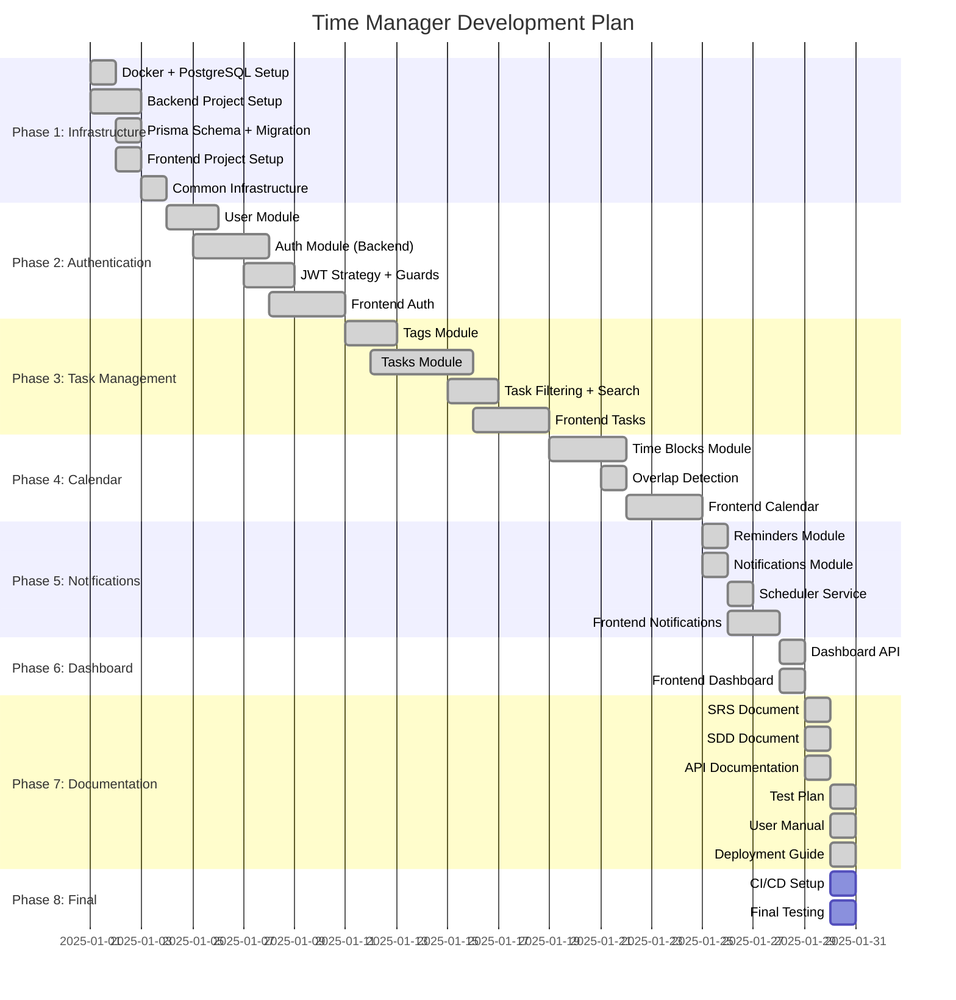

# Project Plan
# Time Manager Application

## 30-Day Development Timeline

## Phase Details

### Phase 1: Infrastructure Setup (Days 1-3)
- [x] Docker Compose with PostgreSQL 16
- [x] NestJS backend project structure
- [x] Prisma ORM setup with schema
- [x] React + Vite frontend setup
- [x] Common DTOs, filters, interceptors

### Phase 2: Authentication (Days 4-10)
- [x] User registration with argon2 hashing
- [x] JWT access token (15 min expiry)
- [x] Refresh token with rotation
- [x] Login/Logout endpoints
- [x] JwtAuthGuard for protected routes
- [x] Frontend auth pages and store

### Phase 3: Task Management (Days 11-18)
- [x] Tags CRUD with ownership validation
- [x] Tasks CRUD with pagination
- [x] Task-Tag relationship
- [x] Filtering by status, priority, date
- [x] Search by keyword
- [x] Frontend task list and forms

### Phase 4: Calendar & Time Blocks (Days 19-24)
- [x] Time blocks CRUD
- [x] Time validation (startAt < endAt)
- [x] Overlap detection and prevention
- [x] Date range queries
- [x] Frontend calendar view

### Phase 5: Reminders & Notifications (Days 25-27)
- [x] Reminders CRUD
- [x] Notifications CRUD
- [x] Scheduler with node-cron
- [x] Automatic notification creation
- [x] Frontend notification badge

### Phase 6: Dashboard & Analytics (Days 28-29)
- [x] Task statistics API
- [x] Focus time calculation
- [x] Frontend dashboard cards

### Phase 7: Documentation (Day 29-30)
- [x] SRS.md - Requirements specification
- [x] SDD.md - System design
- [x] ERD.md - Database schema
- [x] API.md - API documentation
- [x] TestPlan.md - Test cases
- [x] UserManual.md - User guide
- [x] Deployment.md - Setup instructions

### Phase 8: CI/CD & Final (Day 30)
- [ ] GitHub Actions workflow
- [ ] Final integration testing
- [ ] README updates

## Deliverables

### Source Code
- `/backend` - NestJS API
- `/frontend` - React application
- `/docs` - Documentation

### Documentation
- SRS.md - Software Requirements Specification
- SDD.md - Software Design Document
- ERD.md - Entity Relationship Diagram
- API.md - API Documentation
- TestPlan.md - Test Plan and Cases
- UserManual.md - User Manual
- Deployment.md - Deployment Guide
- ProjectPlan.md - This document

### Configuration
- `docker-compose.yml` - Database setup
- `.env.example` files - Environment templates
- `README.md` - Quick start guide

## Team Responsibilities

| Role | Responsibilities |
|------|------------------|
| Backend Developer | API development, database design |
| Frontend Developer | UI implementation, state management |
| DevOps | Docker setup, CI/CD |
| QA | Test planning, test execution |
| Technical Writer | Documentation |

## Risk Management

| Risk | Mitigation |
|------|------------|
| Database connection issues | Docker health checks, retry logic |
| Token security | Short expiry, rotation, hashing |
| Time block overlap | Server-side validation |
| Performance | Pagination, indexes, caching |

## Success Criteria

1. ✅ All CRUD operations work correctly
2. ✅ Authentication flow is secure
3. ✅ Time blocks prevent overlap
4. ✅ Reminders trigger notifications
5. ✅ Dashboard shows accurate stats
6. ✅ Documentation is complete
7. ⏳ CI/CD pipeline passes
8. ✅ Application runs with single README
